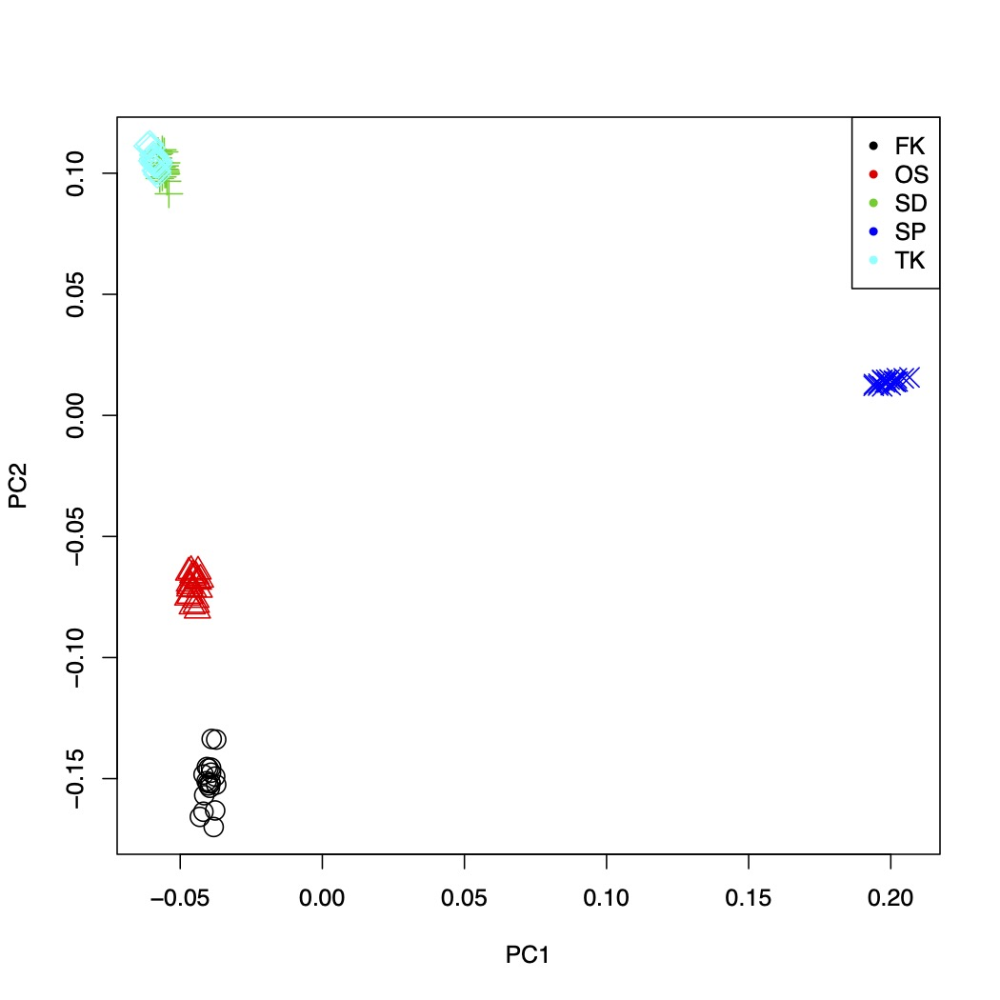

# RAD-seq解析ハンズオン

松波　雅俊（琉球大学大学院医学研究科先進ゲノム検査医学講座）

2023年12月04日作成

## 準備

### サーバへのログイン

まずsshコマンドを用いてサーバにログインしてください。

"user"と"node_name"は割り当てられたものを指定して下さい。

```sh
ssh user@gwa.ddbj.nig.ac.jp
ssh node_name
```

### 使用するプログラム

```sh
singularity exec -B /lustre8,/home /usr/local/biotools/s/stacks:2.65--hdcf5f25_0
singularity exec -B /lustre8,/home /usr/local/biotools/s/samtools:1.18--hd87286a_0
singularity exec -B /lustre8,/home /usr/local/biotools/b/bwa:0.7.8--hed695b0_5
singularity exec -B /lustre8,/home /usr/local/biotools/p/plink:1.90b6.21--hec16e2b_4
```

### 使用するデータ

解析には以下のデータを使用します。

シミュレーションによって作成した <i>Fictus yaponesiae</i> 100 個体分（20 個体/集団）の ddRAD-seq データです。

このデータは，EcoRI（切断サイト:G|AATTC）と MseI（切断サイト:T|TAA）という２つの制限酵素でゲノムを断片化し，各ゲノム断片の両端 100bp のペアエンド配列を解読しています。

（*はワイルドカードです）

```sh
#RAD-seq data
/home/bioarchaeology-pg/data/11/rawdata/*.fq.gz

#sample population data
/home/bioarchaeology-pg/data/11/Popmap.txt

#reference genome
/home/bioarchaeology-pg/data/11/reference/yaponesia_reference.fasta
```


## stacksを使用したチュートリアル

* https://catchenlab.life.illinois.edu/stacks/manual/

まず解析用のディレクトリを作成します。

```sh
mkdir 231210RAD_tutorial
cd 231210RAD_tutorial
```

作業はこのディレクトリで実施します。


### data filtering

最初にstacksのprcocess_radtagsコマンドを用いて、data filteringを実施します。

下記のコマンドでqualtiyの低いリードやアダプター配列を取り除くことができます。

```sh
singularity exec -B /lustre8,/home　/usr/local/biotools/s/stacks:2.65--hdcf5f25_0 \
process_radtags -P \
-1 /home/bioarchaeology-pg/data/11/rawdata/*_R1.fq.gz \
-2 /home/bioarchaeology-pg/data/11/rawdata/*_R2.fq.gz \
-o samples -c -q --renz_1 ecoRI --renz_2 mseI
```
解析がうまくいっていれば、フォルダsamplesに`*_R1.1.fq.gz`, `*_R2.2.fq.gz`, `*_R1.rem.1.fq.gz`, `*_R2.rem.2.fq.gz`の4つのファイルが作られます。

このうち、*_R1.1.fq.gz, *_R2.2.fq.gzを以降の解析に使用します。

さらに以降のコマンドで動かすためにファイル名を変更する必要があります。

```sh
mv samples/*_R1.1.fq.gz samples/*.1.fq.gz
mv samples/*_R2.2.fq.gz samples/*.2.fq.gz
```
以上がdata filteringで使用するコマンドになります。

しかし、このコマンドを100回も打ち込んで動かすのは大変なので、シェルスクリプトを作成し、slurmでjobを投げることで並列計算させましょう。

まず、シェルスクリプト`process_radtags_all.sh`を作成します。

```sh process_radtags_all.sh
#!/bin/bash
#SBATCH --mem=64G 

SAMPLE=$1

module load singularity/3.8.3

singularity exec -B /lustre8,/home /usr/local/biotools/s/stacks:2.65--hdcf5f25_0 \
process_radtags -P \
-1 /home/bioarchaeology-pg/data/11/rawdata/${SAMPLE}_R1.fq.gz \
-2 /home/bioarchaeology-pg/data/11/rawdata/${SAMPLE}_R2.fq.gz \
-o samples \
-c -q --renz_1 ecoRI --renz_2 mseI

mv samples/${SAMPLE}_R1.1.fq.gz samples/${SAMPLE}.1.fq.gz
mv samples/${SAMPLE}_R2.2.fq.gz samples/${SAMPLE}.2.fq.gz
```

このシェルスクリプトでは、コマンドライン上で指定されたサンプル名が${SAMPLE}に代入され、コマンドが実行されます。

slurmではコマンドライン上でループを回すことで並列してjobを投げることができます。

下記の通り、コマンドを打ち込んでください。

```sh
mkdir samples
mkdir process_radtags_all_log

for LOCATION in {FK,OS,SD,SP,TK}; do
  for NUM in {1..20}; do
    if [ ${NUM} -lt 10 ]; then
      ID="${LOCATION}0${NUM}"
    else
      ID="${LOCATION}${NUM}"
    fi
    sbatch -p all -c 1 -n 1 --qos all -o ./process_radtags_all_log/process_radtags_all.${ID}.log \
    -e ./process_radtags_all_log/process_radtags_all.${ID}.error \
    -J ${ID} \
    process_radtags_all.sh ${ID}
  done
done
```
これで100サンプルを同時に処理できます。

標準出力に以下のように表示されればjobの投入は成功です。

```sh
Submitted batch job XX
Submitted batch job XX
...
```

ディレクトリ`samples`にoutput filesができるので、確認して下さい。

ちなみにディレクトリ`process_radtags_all_log`にはjobごとのログファイルが出力されています。

___

### de novo assemble

ここではリファレンスゲノムなしでのstacksのパイプラインを紹介します。

#### ustacks

まず、ustacksコマンドでサンプル内で類似しているリードをクラスタリングし、SNPのリストを作ります。以下のコマンドになります。

```sh
singularity exec -B /lustre8,/home /usr/local/biotools/s/stacks:2.65--hdcf5f25_0 \
ustacks -t gzfastq -f samples/*.1.fq.gz -o denovo_map -i 1 --name * -M 5 -m 3
```

**クラスタリングの際にリード間でどれだけのミスマッチを許すかを指定するパラメータ*M*とどれだけのカバレージで読んでいるリードを用いるかを指定するパラメータ*m*は、結果への影響が大きいので、注意して設定して下さい。**

先ほどと同じようにシェルスクリプト`ustaks_all.sh`を作成します。

```sh ustaks_all.sh
#!/bin/bash
#SBATCH --mem=64G 

SAMPLE=$1

module load singularity/3.8.3

singularity exec -B /lustre8,/home /usr/local/biotools/s/stacks:2.65--hdcf5f25_0 \
ustacks -t gzfastq \
-f samples/${SAMPLE}.1.fq.gz \
-o denovo_map \
-i 1 --name ${SAMPLE} -M 5 -m 3
```

コマンドラインで下記のようの打ち込むことでjobを投入します。

```sh
mkdir denovo_map
mkdir ustacks_all_log

for LOCATION in {FK,OS,SD,SP,TK}; do
  for NUM in {1..20}; do
    if [ ${NUM} -lt 10 ]; then
      ID="${LOCATION}0${NUM}"
    else
      ID="${LOCATION}${NUM}"
    fi
    sbatch -p all -c 1 -n 1 --qos all -o ./ustacks_all_log/ustacks_all_log.${ID}.log \
    -e ./ustacks_all_log/ustacks_all_log.${ID}.error \
    -J ${ID} \
    ustacks_all.sh ${ID}
  done
done
```
これで100サンプルを同時に処理できます。

結果として、ディレクトリ`denovo_map`に`*.alleles.tsv.gz`, `*.snps.tsv.gz`,`*.tags.tsv.gz`の3つのファイルが出力されます。


#### cstacks

次にcstacksコマンドでサンプル間で共有されているSNPのリストを作成します。

パラメータ*n*でカタログを作る際にミスマッチをいくつ許すかを指定します。

このパラメータは結果への影響が大きいので注意が必要です。

今回はコマンドは一度だけなのでそのまま打ち込みましょう。

```sh
singularity exec -B /lustre8,/home /usr/local/biotools/s/stacks:2.65--hdcf5f25_0 \
cstacks -P denovo_map -M /home/bioarchaeology-pg/data/11/Popmap.txt -n 5
```

結果として、ディレクトリ`denovo_map`に`catalog.alleles.tsv.gz`, `catalog.sample_list.tsv.gz`,`catalog.snps.tsv.gz`, `catalog.tags.tsv.gz`の4つのファイルが出力されます。


#### sstacks

cstacksの結果を元にサンプル・遺伝子座ごとのSNPを決定するのがsstacksコマンドです。

これもコマンドラインにコマンドを打ち込みましょう。

```sh
singularity exec -B /lustre8,/home /usr/local/biotools/s/stacks:2.65--hdcf5f25_0 \
sstacks -P denovo_map -M /home/bioarchaeology-pg/data/11/Popmap.txt
```

結果として、ディレクトリ`denovo_map`にサンプルごとに`*.matches.tsv.gz`が出力されます。


#### tsv2bam

sstacksの出力をbamファイルに変換し、ペアードエンドリードの場合は2つのリードの情報を統合するのが，tsv2bamコマンドです。

これもコマンドラインにコマンドを打ち込みましょう。

```sh
singularity exec -B /lustre8,/home /usr/local/biotools/s/stacks:2.65--hdcf5f25_0 \
tsv2bam -P denovo_map -M /home/bioarchaeology-pg/data/11/Popmap.txt -R samples
```

結果として、ディレクトリ`denovo_map`にサンプルごとに`*.matches.bam`が出力されます。

#### gstacks

最後にサンプル全てのSNPのカタログを作成します。

```sh
singularity exec -B /lustre8,/home /usr/local/biotools/s/stacks:2.65--hdcf5f25_0 \
gstacks -P denovo_map -M /home/bioarchaeology-pg/data/11/Popmap.txt
```

結果として、ディレクトリ`denovo_map`に`catalog.calls`, `catalog.fa.gz`の2つのファイルが出力されます。

#### populations

結果を適切なファイルフォーマットに変換します。今回は、vcfに変換します。

```sh
singularity exec -B /lustre8,/home /usr/local/biotools/s/stacks:2.65--hdcf5f25_0 \
populations -P denovo_map --vcf
```

結果として、ディレクトリ`denovo_map`にhaplotypeを考慮したvcf file `populations.haps.vcf`と、考慮しないvcf file`populations.snps.vcf`が出力されます。

目的に応じて適切なファイルを以降の解析に使用して下さい。


___
### with reference genome

ここではリファレンスゲノムありでのstacksのパイプラインを紹介します。

#### mapping

リファレンスゲノムがある場合は、まずreadをgenomeにmappingします。

今回は、bwaでmappingします。また、mapping後に.sam fileを.bam fileに変換する必要があります。

先ほどと同じようにシェルスクリプトを作って、slurmで処理しましょう。

まず、下記のシェルスクリプト`bwa_all.sh`を作成します。

```sh
#!/bin/bash
#SBATCH --mem=64G 

SAMPLE=$1

module load singularity/3.8.3

#mapping
singularity exec -B /lustre8,/home /usr/local/biotools/b/bwa:0.7.8--hed695b0_5 \
bwa mem /home/bioarchaeology-pg/data/11/reference/yaponesia_reference.fasta \
samples/${SAMPLE}.1.fq.gz \
samples/${SAMPLE}.2.fq.gz \
> mapping/${SAMPLE}.sam

#sam2bam
singularity exec -B /lustre8,/home /usr/local/biotools/s/samtools:1.18--hd87286a_0 \
samtools view -bS mapping/${SAMPLE}.sam > mapping/${SAMPLE}.bam

#sort
singularity exec -B /lustre8,/home /usr/local/biotools/s/samtools:1.18--hd87286a_0 \
samtools sort mapping/${SAMPLE}.bam -o mapping/${SAMPLE}.bam
```

このスクリプトでは、bwaでreadをリファレンスゲノムにmappingし, samtoolsでファイルをsamからbamフォーマットに変換し、そのあとソートしています。

これをコマンドラインでloopでjobを投げます。

```sh
mkdir mapping
mkdir bwa_all_log

for LOCATION in {FK,OS,SD,SP,TK}; do
  for NUM in {1..20}; do
    if [ ${NUM} -lt 10 ]; then
      ID="${LOCATION}0${NUM}"
    else
      ID="${LOCATION}${NUM}"
    fi
    sbatch -p all -c 1 -n 1 --qos all -o ./bwa_all_log/bwa_all_log.${ID}.log \
    -e ./bwa_all_log/bwa_all_log.${ID}.error \
    -J ${ID} \
    bwa_all.sh ${ID}
  done
done
```

ディレクトリ`mapping`にsampleごとに`*.sam`と`*.bam`の2つのファイルが出力されていれば成功です。


#### stacks

mapping結果をstacksで処理することでSNPをコールします。

先ほども使用した`gstacks`と`populations`の2つのコマンドを使用します。

```sh
#make output directory
mkdir ref_map

#gstacks
singularity exec -B /lustre8,/home /usr/local/biotools/s/stacks:2.65--hdcf5f25_0 \
gstacks -I mapping -M /home/bioarchaeology-pg/data/11/Popmap.txt -O ref_map

#populations
singularity exec -B /lustre8,/home /usr/local/biotools/s/stacks:2.65--hdcf5f25_0 \
populations -P ref_map --vcf

```

これでvcfファイルを出力できました。

リファレンスゲノムがある場合は、リファレンスゲノムがない場合に比べて、用いるコマンドは少なくなります。

___
### PCA

リファレンスゲノムありでの解析結果を元にPCA解析を行い、結果をプロットしてみましょう。

#### plinkでPCA

今回はplinkを用いてPCA解析しましょう。

下記のコマンドで出力されたvcfファイルをplinkのinputフォーマットであるbedファイルに変換し、PCAします。

```sh
#make dir
mkdir PCA

#vcf2bed
singularity exec -B /lustre8,/home /usr/local/biotools/p/plink:1.90b6.21--hec16e2b_4 \
plink --vcf ref_map/populations.snps.vcf --make-bed --out PCA/populations.snps

#PCA
singularity exec -B /lustre8,/home /usr/local/biotools/p/plink:1.90b6.21--hec16e2b_4 \
plink --bfile PCA/populations.snps --out PCA/populations.snps --pca

```

ディレクトリ`PCA`に出力された`populations.snps.eigenval`と`populations.snps.eigenvec`の2つのファイルが結果です。

#### plot

結果を描画しましょう。

コマンドラインでRを起動します。

```sh
module load r/3.5.2
R
```

Rが起動したら下記の通り打ち込んでください。

```R
fn   <- "PCA/populations.snps.eigenvec"
pfn  <- "/home/bioarchaeology-pg/data/11/Popmap.txt"
evec <- read.table(fn)
Pop  <- read.table(pfn, col.names=c("Sample", "Pop"))

pdf("PC1vsPC2.pdf")
plot(evec$V3, evec$V4, pch=as.numeric(factor(Pop$Pop)),
col=factor(Pop$Pop), cex=1.8, xlab="PC1", ylab="PC2")
legend("topright", legend=levels(factor(Pop$Pop)),
col=1:length(levels(factor(Pop$Pop))), pch=20)
dev.off()

```
このような図が描けるはずです。



以上になります。

余力があればde novoの場合のPCAなども試してみて下さい。
